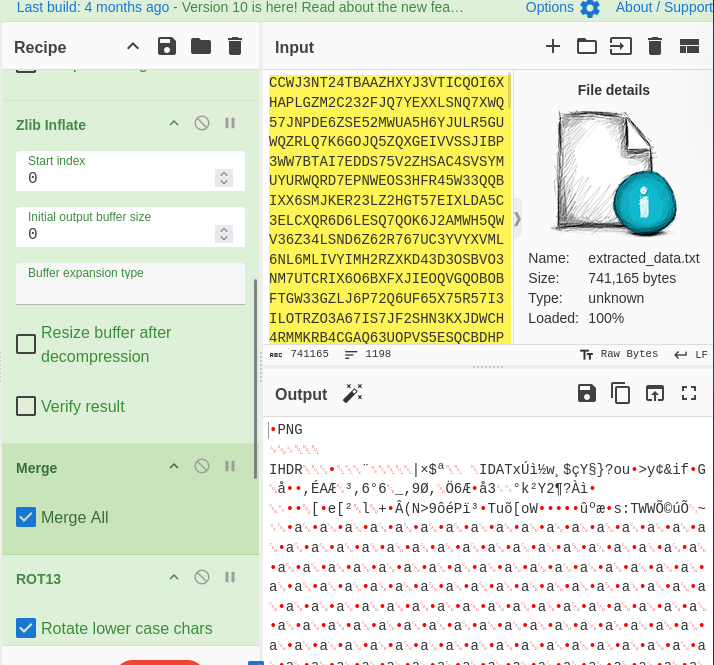

## The Challenge
**Note:** *You can get the link to this challenge from Advent of cyber 2025 day 17*

**Scrambled Image Source:**  
The scrambled Easter Egg was available at: 
```https://tryhackme-images.s3.amazonaws.com/user-uploads/5ed5961c6276df568891c3ea/room-content/5ed5961c6276df568891c3ea-1765955075920.png```

To get the real image we just have to reverse the algorithm
## The Encryption Algorithm

The original scrambling process (as seen in the CyberChef screenshots) applied the following steps:

1. **To Base64**: Converted the original image file into Base64 text encoding.
    
2. **ROT13 Loop (Jump)**: Applied a ROT13 cipher 9 times with an amount of 7, resulting in a cumulative rotation of 63 positions (equivalent to ROT11 modulo 26).
    
3. **Zlib Deflate**: Compressed the rotated data using Zlib compression.
    
4. **XOR Encryption**: Encrypted the compressed data using the key `h0pp3r` with Standard scheme.
    
5. **To Base32**: Converted the encrypted binary data into Base32 text format.
    
6. **Fork/Merge**: Split the Base32 string by newlines for processing.
    
7. **Generate Image**: Converted the text data into pixel values and rendered them as a PNG image.

## The Decryption Process

## Step 1: Extract Pixel Data from the PNG

The first critical step was to extract the raw pixel values from the scrambled image. Since CyberChef's `Generate Image` converts text into pixel intensities, we needed to reverse this by reading the pixel values back out.

```python

from PIL import Image
import sys

input_filename = "Scramb.png"
output_filename = "extracted_data.txt"

try:
    print(f"Opening {input_filename}...")
    img = Image.open(input_filename)

    print(f"Image mode is: {img.mode}")

    pixels = list(img.getdata())

    if isinstance(pixels[0], tuple):
        print("Detected multi-channel image. Extracting first channel...")
        pixel_values = [p[0] for p in pixels]
    else:
        pixel_values = pixels

    data_bytes = bytes(pixel_values)

    data_bytes = data_bytes.rstrip(b'\x00')

    with open(output_filename, "wb") as f:
        f.write(data_bytes)
    print(f"Success! Extracted {len(data_bytes)} bytes.")
    print(f"Data saved to '{output_filename}'.")

except FileNotFoundError:
    print(f"Error: Could not find file '{input_filename}'")
except Exception as e:
    print(f"An error occurred: {e}")
```

**Now the generated file is your input to cyber-chef**

## Step 2: Reverse the given algorithm
**Below is the reversed algorithm recipe**

```json
[
  { "op": "Fork",
    "args": ["\\n", "", false] },
  { "op": "From Base32",
    "args": ["A-Z2-7=", true] },
  { "op": "XOR",
    "args": [{"option": "UTF8", "string": "h0pp3r"}, "Standard", false] },
  { "op": "Zlib Inflate",
    "args": [0, 0, false] },
  { "op": "Merge",
    "args": [] },
  { "op": "ROT13",
    "args": [true, true, false, 15] },
  { "op": "From Base64",
    "args": ["A-Za-z0-9+/=", true, false] }
]
```

Now look at the output section; You Got the real png. 




Click on the save icon in output section and save it as egg.png


# 
